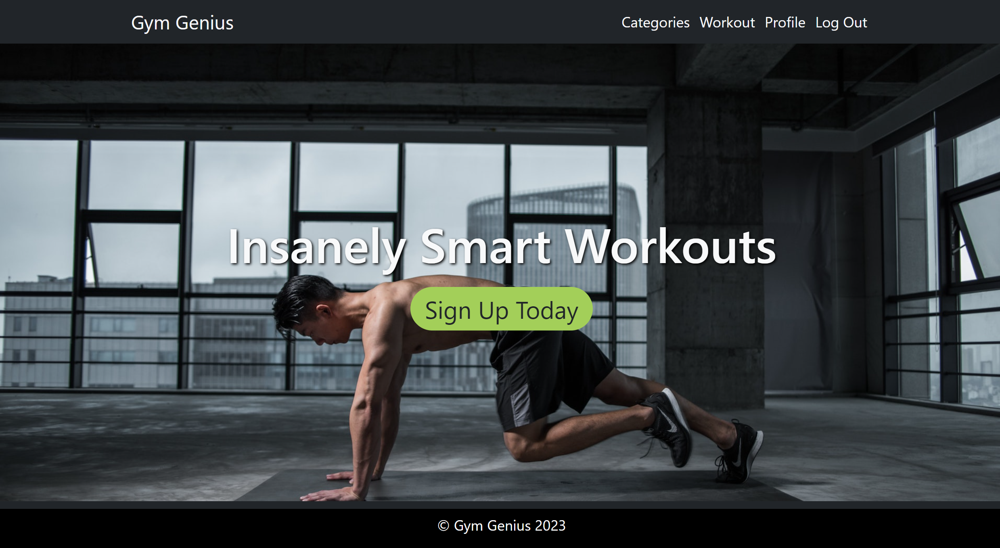
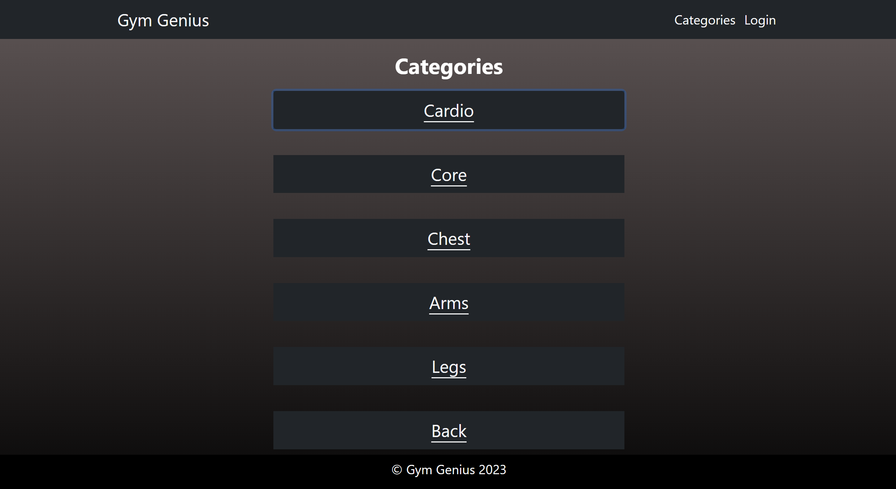
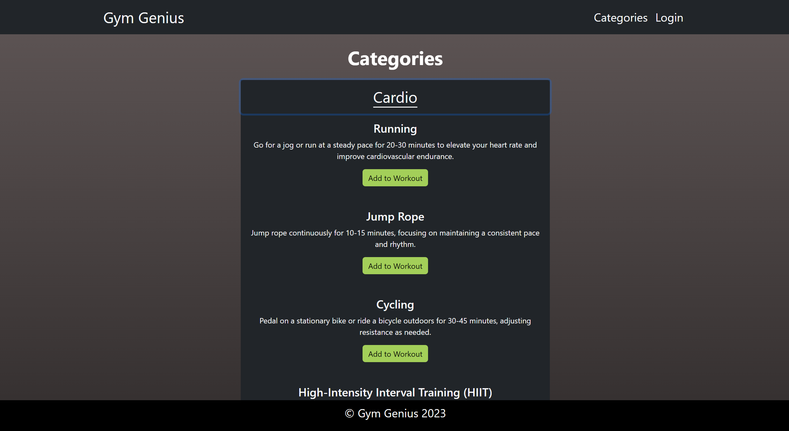
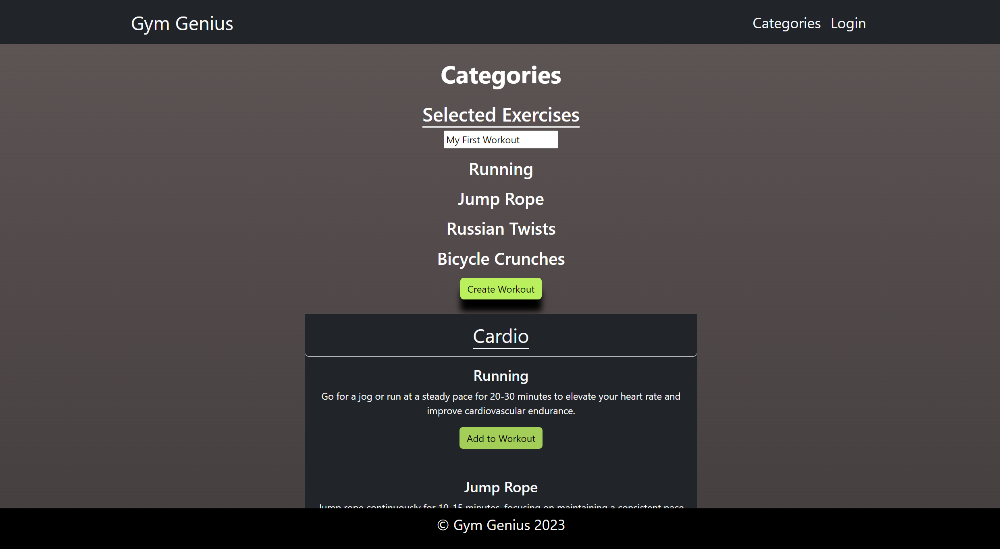
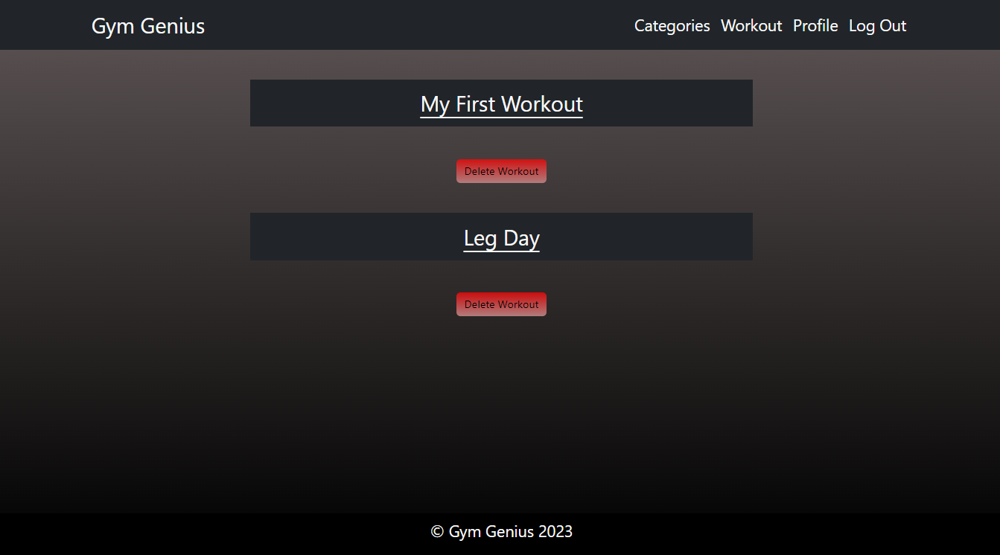
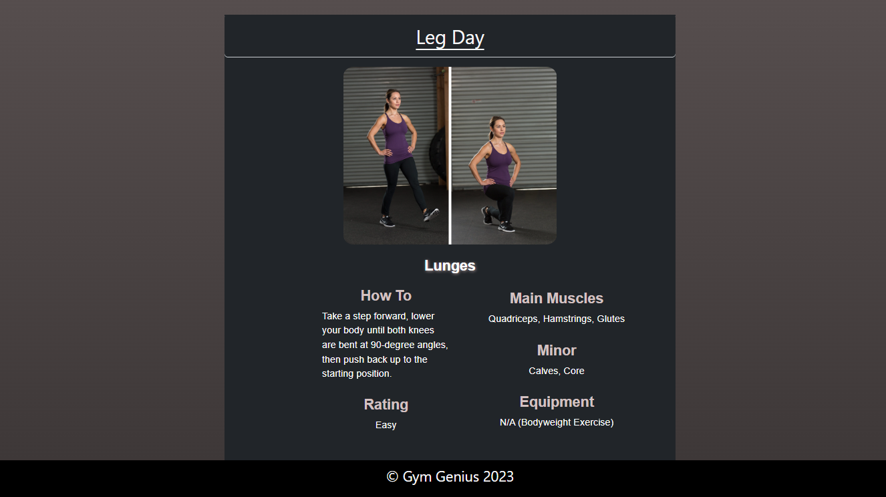
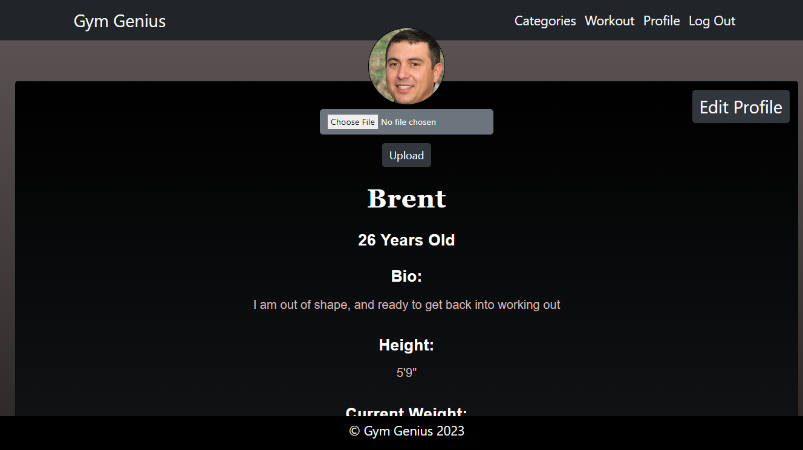

# Gym Genius                         

## Table of Contents

1. [Description](#description)
2. [Live Link](#live-link)
3. [Usage](#usage)
4. [Collaborators](#collaborators)
5. [License](#license)
6. [Installation](#installation)
7. [Screenshots](#screenshots)

## Description

Gym Genius is an application that allows users to create workouts to plan their exercise routine. Using our vast array of different exercises, the user can choose from different categories to target specific muscle groups. This website aims to provide a modular experience for anyone looking to further their workout goals.

This web app is built using the MERN stack. It utilizes GraphQL queries and mutations to manipulate the user data. User profile information is protected and authenticated via JWT encoding. The front-end is built using the Create React App framework.

While Most of the data is stored via MongoDB Atlas, the avatar profile images are stored and referenced in an Amazon Web Services S3 bucket. As users change their profile picture, the old picture is deleted and the new one is saved using the unique user email as the file name. 

## Live Link                      

https://gym-genius-9546c612d270.herokuapp.com/               

## Installation                  

### Prerequisites                    
1. Have node.js environment installed on your machine
2. Have MongoDB installed and setup on your local machine                    

### Instructions                     
1. Clone this repository via `git clone git@github.com:jonathanjjolsen/gym-genius.git`
2. Install node packages at the root level via `npm i`
3. Seed the database via the install script `npm run seed` 
4. Create a .env file in the `/server` folder and the `/client` folder. Create your environment variables with your own AWS credentials:                
    REACT_APP_REGION                      
    REACT_APP_ACCESS_KEY_ID                            
    REACT_APP_SECRET_ACCESS_KEY                               
    REACT_APP_BUCKET_NAME        
5. Start the application server by running the `dev` script via `npm run dev`                 

## Usage

-Create a user profile. 
-Select a category of exercises. 
-Select the exercise to be added. 
-Select which workout you would like to add the exercises to. 
-Once you've finished building your workout, you can view the workouts on the Workout page. 
-You can update your profile information on the profile page with your bio, basic attributes like height and weight, and profile picture.

## Collaborators
- Jonathan Olsen
- Brent Buchanan
- Chris Gramer
- Hugo Olivares                           

## License                             

Licensed under the The MIT License    
          

## Screenshots                                     
                                       
### Landing Page                              
                       
### Exercise Categories                              
                         
### Expanded Categories                             
         
### Add Exercise to Workout                                     
 
### Workouts Page                                     
     
### Workouts Expanded                                           
  
### Profile Page       
                         
 

